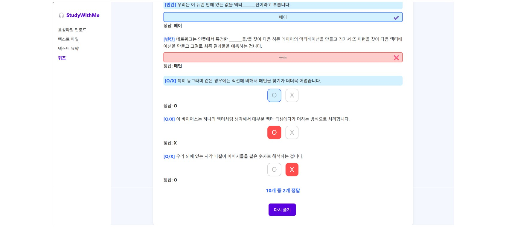

# 강의 요약 및 퀴즈 생성기

> <span style="color:gray"><strong>단국대학교 오픈소스SW기초 6분반 15조</strong><br>
조원: 박수빈, 변윤성, 이지호</span>
<br>



<br>

## 💡 프로젝트 소개

본 프로젝트는 강의 내용을 자동으로 요약하고, 요약된 내용을 바탕으로 관련 퀴즈를 생성하는 웹 애플리케이션이다. 사용자는 강의 음성을 업로드해 텍스트로 변환(STT, Speech to Text)할 수 있으며 이 내용을 기반으로 핵심 내용을 간결하게 요약한다.

STT 기능은 Microsoft Azure의 음성 인식 서비스를 활용하여 높은 정확도와 안정성을 보장한다. 요약은 한국어 맞춤형 딥러닝 모델인 KoBART와 TextRank 알고리즘을 병행 사용하여 문서의 주요 내용을 효과적으로 추출하도록 했다.

이후 요약된 내용을 토대로 빈칸, OX 퀴즈 등의 문제를 자동으로 생성하여 학습자의 이해도를 점검할 수 있도록 설계했다. 프론트엔드에서는 React를 사용하여 사용자 친화적인 인터페이스를 구현하였고, 백엔드는 Python Flask 기반으로 API 서버를 구축하여 데이터를 처리를 구현했다.

<br>

## 📁 디렉토리 구조

디렉토리의 자세한 파일은 각 작업 브랜치에서 확인하실 수 있습니다.
```bash
C:.
│  .gitignore
│  README.md
│
├─backend                              
│  │  .env                              
│  │  requirements.txt                 
│  │
│  └─app
│      │  main.py    
│      ├─preprocess                 
│      ├─quiz_list
│      ├─stt
│      └─summary
│
└─frontend
    │  package-lock.json
    │  package.json
    │
    ├─public
    └─src
        ├─components
        └─pages
```

<br>

## ⚙️ 설치 및 실행 방법

### 프로젝트 클론
```bash
git clone https://github.com/iamdbstjd/OS_15
cd OS_15
```

### 백엔드 서버 실행 후 프론트엔드 실행
```bash
# 1. 가상환경 생성 및 활성화(선택 사항)
python -m venv venv
source venv/bin/activate  # macOS/Linux
venv\Scripts\activate     # Windows

# 2. 의존성 설치
cd backend
pip install -r requirements.txt

# 3. 백엔드 서버 실행
uvicorn app.main:app

# 4. 프론트엔드 실행
cd ../frontend
npm install
npm start

# 참고: 서버 실행 주소
> 백엔드: http://localhost:8000  
> 프론트엔드: http://localhost:3000
```

<br>

## ✏️ 커밋 메시지 접두사

- feat: 새로운 기능에 대한 커밋
- fix: 버그 수정에 대한 커밋
- build: 빌드 관련 파일 수정 / 모듈 설치 또는 삭제에 대한 커밋
- chore: 그 외 자잘한 수정에 대한 커밋
- ci: ci 관련 설정 수정에 대한 커밋
- docs: 문서 수정에 대한 커밋
- style: 코드 스타일 혹은 포맷 등에 관한 커밋
- refactor: 코드 리팩토링에 대한 커밋
- test: 테스트 코드 수정에 대한 커밋
